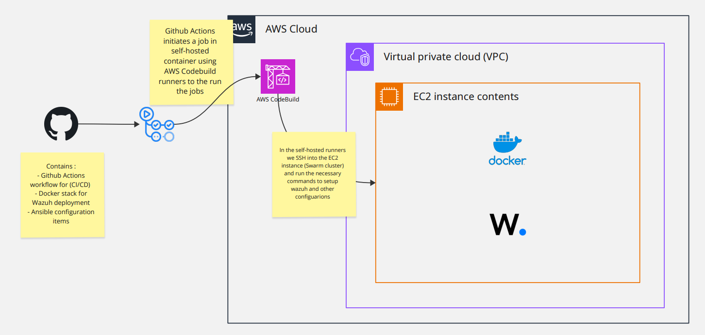
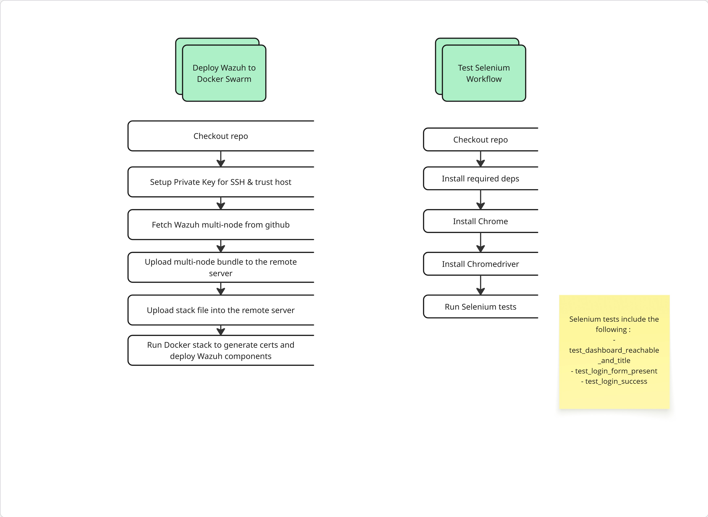
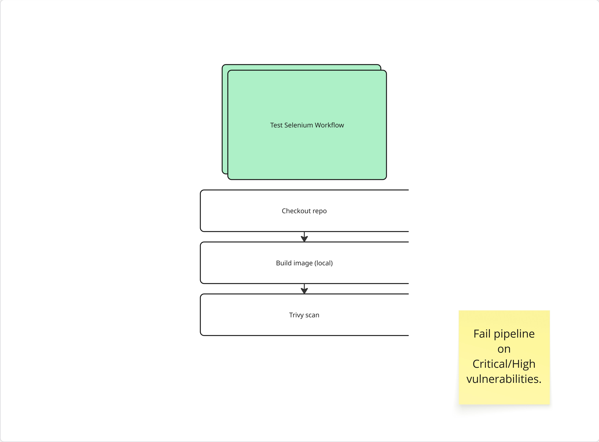

# 🚀 Wazuh Deployment with CI/CD on AWS

This repository contains an automated **CI/CD pipeline** for deploying **Wazuh in a multi-node Docker Swarm cluster** using **GitHub Actions, AWS CodeBuild (self-hosted runners).  

The pipeline builds, tests, and deploys Wazuh components inside an AWS environment while enforcing security best practices (secrets, TLS, scanning, etc.).

---

## 📌 Architecture Overview

The deployment environment is built entirely on **AWS Cloud** to ensure scalability, isolation, and automation of the CI/CD process. The main components are:

  
<!-- Replace with the correct relative path to your first diagram -->

### 🔹 GitHub Actions
- Acts as the central CI/CD orchestrator.
- On every **push/PR to main**, workflows are triggered automatically.
- Jobs are dispatched to **self-hosted runners** (in AWS CodeBuild) instead of using GitHub’s hosted runners, which gives more control over the environment and avoids runner limitations.

### 🔹 AWS CodeBuild (Self-Hosted Runner)
- CodeBuild is configured as a **GitHub self-hosted runner**.
- Provides an **isolated container environment** for running jobs securely.
- Responsible for executing tasks such as:
  - Building container images.
  - Running vulnerability scans (e.g., with Trivy).
  - Executing Selenium tests.
  - Deploying to the target EC2 instance.

This approach ensures that the build environment is **ephemeral** (destroyed after each job), reducing persistence risks.

### 🔹 Virtual Private Cloud (VPC)
- The EC2 instance is deployed inside a **private subnet** of an AWS VPC.
- Security Groups restrict access (e.g., only allowing SSH from CodeBuild, and exposing only necessary Wazuh dashboard ports).
- Ensures isolation from the public internet except where strictly needed.

### 🔹 EC2 Instance (Docker Swarm Manager)
- Acts as the **control plane** of the Docker Swarm cluster.
- Hosts the **Wazuh multi-node stack** (manager, indexer, dashboard).
- Deployment flow:
  1. CodeBuild establishes an **SSH connection** to the EC2 instance.
  2. Stack files and configuration are securely transferred.
  3. Docker Swarm orchestrates the deployment of Wazuh services.
  4. Certificates are generated dynamically to secure Wazuh communications.

### 🔹 Docker Swarm & Wazuh
- **Docker Swarm** is used for container orchestration because it’s simple to set up on a single EC2 instance (and can be extended for multi-node clusters).
- **Wazuh Components** deployed:
  - Wazuh Manager
  - Wazuh Indexer
  - Wazuh Dashboard
- Services are containerized, ensuring **reproducibility** and **scalability**.

---

✅ This architecture ensures:  
- **Automation**: Full CI/CD with no manual intervention.  
- **Security**: Ephemeral build runners, VPC isolation, secrets in GitHub.  
- **Scalability**: Can extend the Docker Swarm cluster with additional EC2 nodes.  
- **Resilience**: Rollback possible by re-deploying a previous stack version.  

---

## 📂 Repository Structure

```text
C:.
|   README.md                # Documentation
|
+---.github
|   \---workflows
|           ci-cd.yaml       # Workflow for image build & security scan
|           deploy-wazuh-stack.yaml  # Workflow for Wazuh stack deployment
|
+---custom_rules
|       local_decoder.xml
|       local_rules.xml
|
+---docs
|       aws-architecture.png # AWS architecture diagram
|       workflow1.jpg        # Workflow 1: Deploy Wazuh
|       workflow2.jpg        # Workflow 2: Image scan workflow
|
+---image-security
|       app.py               # Sample local Flask app
|       Dockerfile           # Container definition
|       requirements.txt     # Python dependencies
|       wsgi.py              # WSGI entrypoint
|
+---selenium-tests
|   |   test_api.py          # API health tests
|   |   test_dashboard.py    # Dashboard functionality tests
|   |
|   \---__pycache__          # Compiled test artifacts
|
\---stack
        stack-wazuh.yml      # Docker Swarm stack definition for Wazuh
```


---

This project delivers a **Mini SOC** based on **Wazuh** deployed via **Docker Swarm**, fully automated through **GitHub Actions**.  
It integrates **image scanning**, **automated testing**, and **secure deployment practices**, showcasing end-to-end DevOps methodology.


---
## ⚙️ CI/CD Workflows

This repository defines **two main workflows** under `.github/workflows/`:

1. **`deploy-wazuh-stack.yaml`** → Deploys the **Wazuh multi-node stack** on Docker Swarm (via AWS EC2).  
2. **`ci-cd.yaml`** → Builds and scans container images (for the local app), runs Selenium tests, and enforces security gates.

---

### 🔹 Workflow 1 – Deploy Wazuh Stack

  

### 1. **Deploy Wazuh to Docker Swarm**
This job provisions the **Wazuh stack** into the EC2 instance (Swarm manager node).  
Steps:
1. Checkout repository  
2. Configure SSH (private key & known hosts)  
3. Fetch Wazuh multi-node bundle  
4. Upload bundle + stack files to EC2 instance  
5. Run Docker stack to generate certificates & deploy Wazuh components  

---

### 2. **Run Selenium Tests**
Steps:
1. Checkout repository  
2. Install dependencies (Python, pip, etc.)  
3. Install **Chrome** & **Chromedriver**  
4. Run **Selenium tests** against the Wazuh dashboard  

Tests include:  
- ✅ Dashboard reachable & title check  
- ✅ Login form presence  
- ✅ Successful login  

---

### 🔹 Workflow 2 – CI/CD & Security Scans

  

This workflow is responsible for **building and securing container images** of a local Flask app (`app.py`).  
Steps:
1. Checkout repository.  
2. Build container image locally (using provided `Dockerfile`).  
3. Run **Trivy security scan**.  
   - Pipeline **fails automatically** if **Critical** or **High** vulnerabilities are found.  

This enforces **security by design** in the CI/CD lifecycle: no vulnerable images can be deployed.

---

### 🔹 Selenium Tests

After deployment, Selenium tests validate that the **Wazuh dashboard and APIs are functional**.  

Tests include:
- ✅ Dashboard reachable & title check  
- ✅ Login form present  
- ✅ Successful login  
- ✅ API endpoint health check (`test_api.py`)  

This ensures **functionality and availability** of the deployed Wazuh stack.

---


## 🛠️ Prerequisites
Before running the pipeline, ensure you have:  
- AWS account with **VPC, EC2, and CodeBuild** configured  
- Docker & Docker Swarm installed on target EC2 instance  
- GitHub repository with:  
  - Workflows under `.github/workflows/*.yml`  
  - Docker stack definition for Wazuh deployment  
  - Ansible configuration items  
- GitHub Secrets:  
  - `AWS_ACCESS_KEY_ID` / `AWS_SECRET_ACCESS_KEY`  
  - `SSH_PRIVATE_KEY` (for EC2 connection)  
  - Any other required secrets (TLS, Wazuh credentials, etc.)  

## 🚀 Deployment Guide

This project supports two deployment modes:
1. **Local deployment** (developer/test machine).
2. **Automated deployment via CI/CD** (GitHub Actions + Ansible + Docker Swarm).

---

## 🚀 Local Deployment of Wazuh Stack (Multi-Node)

This section explains how to deploy the **Wazuh SIEM stack locally** in a multinode architecture using Docker Compose or Docker Swarm.  
The setup follows the official [Wazuh documentation](https://documentation.wazuh.com) and includes **self-signed certificates** for secure communication between components.

---

### 🏗️ Architecture Overview

- **Wazuh Manager** → Handles agents, analysis, rules, and alerts.  
- **Wazuh Indexer** (OpenSearch fork) → Stores and indexes event/log data.  
- **Wazuh Dashboard** → Web UI to visualize alerts and manage configuration.  
- **Agents** → Installed on endpoints, sending security events to the manager.  

All nodes communicate via **TLS**, secured by **self-signed certificates**.

---

### 📦 Prerequisites

- Docker Engine >= 20.x  
- Docker Compose >= v2.x (if not using Swarm)  
- At least **4 GB RAM** and **2 vCPUs** per node recommended  

---
### Run this command : 
```bash
sysctl -w vm.max_map_count=262144
```
### Clone the repository : 
```bash
git clone https://github.com/wazuh/wazuh-docker.git
cd wazuh-docker/multi-node
```
### 🔑 Generate Self-Signed Certificates

Wazuh requires TLS certificates for secure communication.  
Run the following commands on the host before deploying:
Start the stack:
```bash
docker-compose -f generate-indexer-certs.yml run --rm generator
```
### ⚙️ Deployment with Docker Swarm (Local)

```bash
docker swarm init
```
Initialize Swarm (only first time):

### Deploy the stack:
```bash
docker stack deploy -c docker-swarm.yml wazuh
```

Verify services:
```bash
docker service ls
```

## 📡 CI/CD Deployment (via GitHub Actions)

This repository supports automated deployment of the **Wazuh stack** using GitHub Actions and a self-hosted runner.

---

### ⚙️ Deployment Steps via CI/CD

1. **Set up the self-hosted runner**
   - Ensure your runner (e.g., in AWS CodeBuild) is registered with GitHub.
   - It will execute all GitHub Actions jobs for deployment.

2. **Generate SSH Key Pair**
   ```bash
   ssh-keygen -t rsa -b 4096 -C "wazuh-deploy"
    ```
   Copy the public key to the EC2 instance (~/.ssh/authorized_keys).
   Store the private key in GitHub Actions secrets (e.g., AWS_SSH_KEY).

3. **Clone the repository
4. **Push your code to GitHub
    ```bash
   git add .
   git commit -m "Initial Wazuh deployment pipeline"
   git push origin main
    ```

